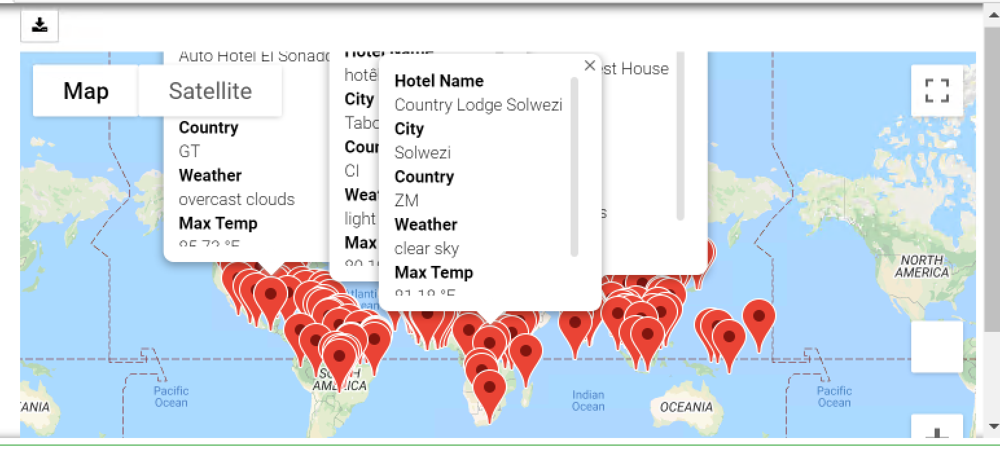
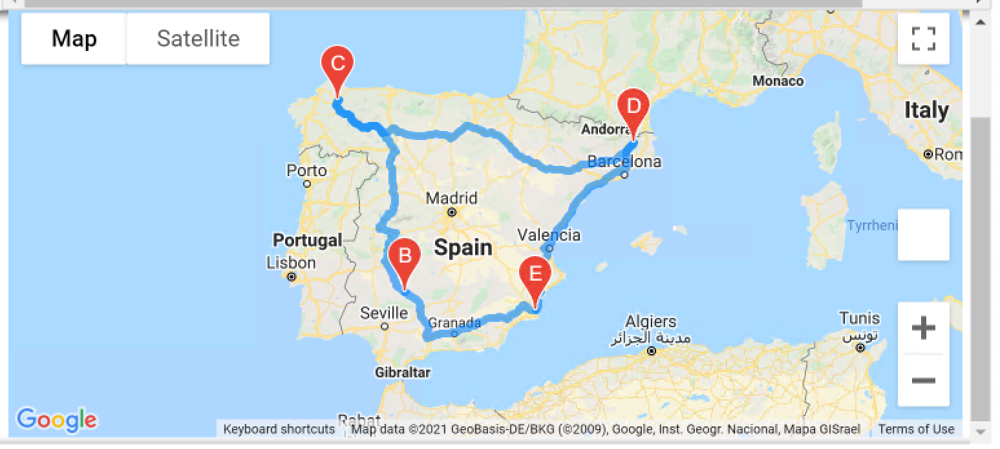

# World_Weather_Analysis

> (M6) In this app, we can find ideal holiday city list based on expected weather range; find hotels near the cities; and find the route links the cities.

* to find cities:

* filter target cities:

* find available hotels:

* display on map with labels:

* setup stops:

* plan route:

The PlanMyTrip app is recommended a few changes to be taken to the next level. Specifically, they recommend adding the weather description to the weather data you’ve already retrieved in this module. Then, add statements to filter the data for the weather preferences, which will be used to identify potential travel destinations and nearby hotels. From the list of potential travel destinations, the beta tester will choose four cities to create a travel itinerary. Finally, using the Google Maps Directions API, a travel route between the four cities as well as a marker layer map is created.

